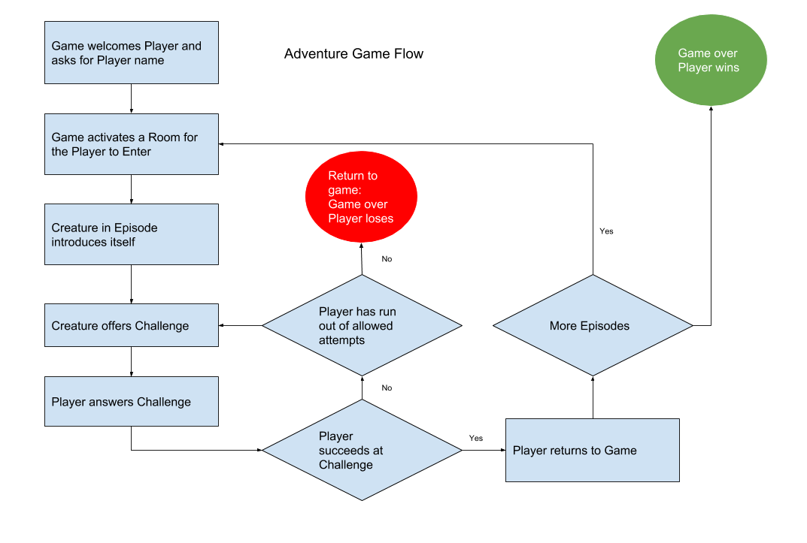
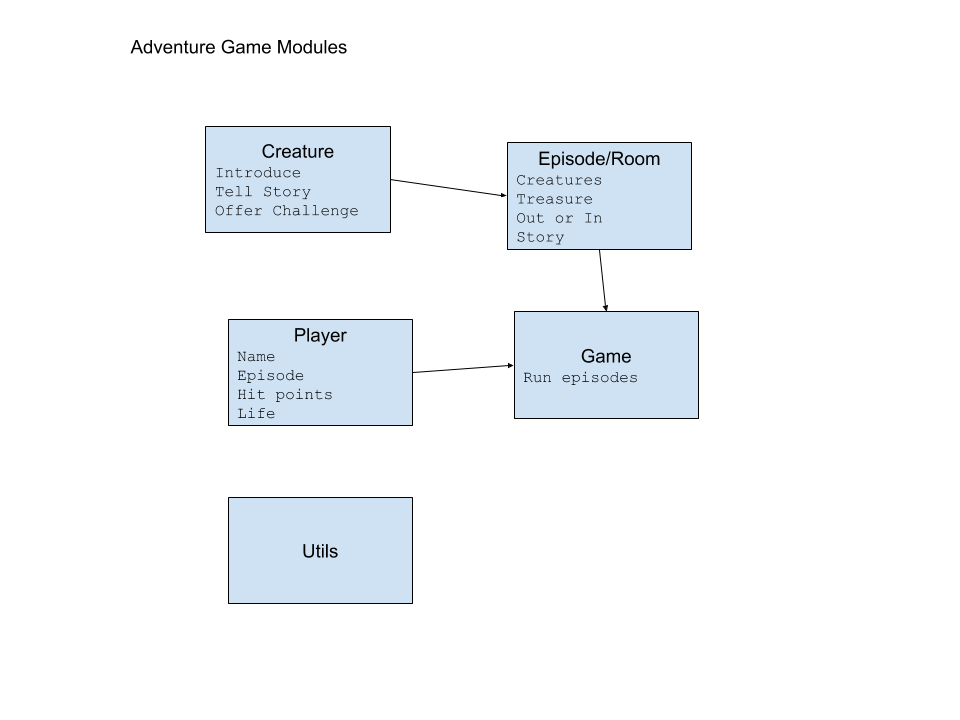

# The Adventure Game

The flow of the game is showing in the diagram below:

The Adventure Game is made up of Modules. There can be many Challenge modules and they are assigned to an Episode to be offered up to the Player. If the Player succeeds in meeting the Challenge, the Game takes back control and either the Player wins or is sent to another Episode.

